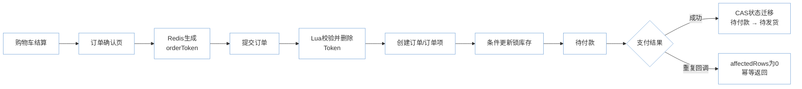
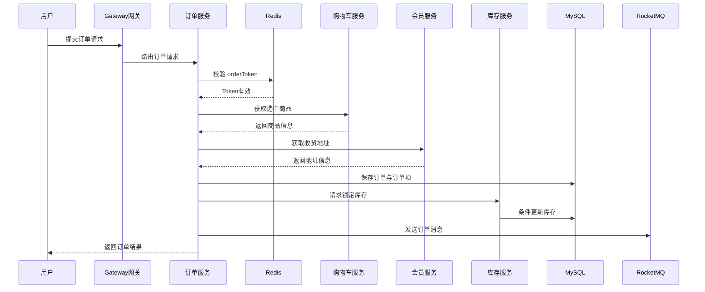
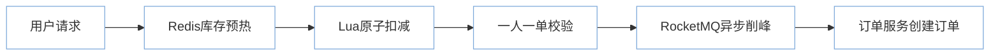
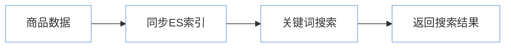

# 3C 数码商城交易系统

基于 **Spring Cloud 微服务架构** 实现的 3C 数码商城交易系统。

本项目围绕真实电商交易链路进行设计，在原商城工程基础上进行了业务梳理和工程优化，重点解决商城系统中的高频工程问题：

-   订单重复提交
-   支付回调重复通知
-   高并发库存超卖
-   秒杀瞬时流量冲击
-   商品搜索性能优化

## 项目亮点

### 1. 分布式交易链路优化

围绕商城核心交易流程，对订单、库存、支付等关键环节进行优化：

-   Redis Token + Lua 实现订单防重复提交
-   CAS 条件更新保证支付回调幂等
-   MySQL 条件更新避免库存超卖
-   RocketMQ 异步削峰提升系统吞吐能力
-   Elasticsearch 提升商品搜索效率

### 2. 面向业务场景的工程优化

项目重点关注：

-   用户重复点击提交订单如何避免重复创建
-   支付平台重复回调如何保证数据一致
-   多用户同时购买如何保证库存正确
-   秒杀场景如何降低数据库压力

# 系统架构

项目采用 Spring Cloud 微服务架构，根据业务领域进行服务拆分：

-   Gateway 网关服务
-   认证服务
-   商品服务
-   购物车服务
-   订单服务
-   库存服务
-   会员服务
-   优惠券服务
-   秒杀服务
-   搜索服务
-   第三方服务

## 系统架构图


# 核心交易链路

## 下单与支付核心链路图



## 链路说明

1.  用户购物车结算进入订单确认页
2.  订单服务生成 orderToken 并保存到 Redis
3.  提交订单时通过 Lua 脚本校验并删除 Token，保证原子性
4.  创建订单和订单项
5.  库存服务通过条件更新锁定库存
6.  订单进入待付款状态
7.  支付成功后通过 CAS 更新订单状态，保证支付幂等

# 下单时序图



# 核心技术优化

## 1. Redis + Lua 实现订单防重复提交

### 问题

用户重复点击提交订单，可能导致重复创建订单。

### 解决方案

订单确认页生成 orderToken：

``` text
Redis

key: order:token:userId

value: token
```

提交订单时：

``` text
Lua脚本：

1. 校验Token

2. 删除Token
```

保证校验和删除操作原子执行。

核心代码位置：

``` text
mall-order

OrderServiceImpl.java

submitOrder()
```

------------------------------------------------------------------------

## 2. 支付回调幂等设计

### 问题

第三方支付平台可能重复发送支付成功通知。

### 解决方案

采用 CAS 条件更新：

``` sql
update oms_order
set status = '待发货'
where order_sn = ?
and status = '待付款';
```

第一次回调：

``` text
affectedRows = 1

更新成功
```

重复回调：

``` text
affectedRows = 0

无需处理
```

核心代码位置：

``` text
mall-order

OrderServiceImpl.java

handlePayResult()
```

------------------------------------------------------------------------

## 3. 库存条件更新防止超卖

### 问题

多个用户同时购买同一商品，可能造成库存超卖。

### 解决方案

使用数据库条件更新：

``` sql
update wms_ware_sku
set stock_locked = stock_locked + #{num}
where sku_id = #{skuId}
and stock - stock_locked >= #{num};
```

只有满足库存条件时才允许锁定库存。

核心代码位置：

``` text
mall-ware

WareSkuDao.xml

lockSkuStock()
```

------------------------------------------------------------------------

## 4. 秒杀高并发优化

秒杀流程：



优化：

-   Redis缓存热点数据
-   Lua保证扣减原子性
-   MQ异步削峰

------------------------------------------------------------------------

## 5. Elasticsearch 商品搜索

商品搜索流程：



核心代码：

``` text
mall-search
```

# 技术栈

  技术            应用
  --------------- --------------------
  Spring Boot     服务开发
  Spring Cloud    微服务治理
  Gateway         网关路由
  Nacos           注册中心与配置中心
  OpenFeign       服务调用
  MyBatis-Plus    数据访问
  MySQL           业务数据存储
  Redis           缓存与分布式控制
  RocketMQ        异步消息
  Elasticsearch   商品搜索
  Seata           分布式事务
  Sentinel        服务保护

# 项目结构

``` text
mall-auth_server
mall-member
mall-product
mall-cart
mall-order
mall-ware
mall-coupon
mall-seckill
mall-search
mall-third-party
mall-gateway
mall-commons
```

# 运行环境

-   JDK 8+
-   Maven
-   MySQL 8
-   Redis
-   Nacos
-   RocketMQ
-   Elasticsearch

# 项目总结

通过该项目实践了：

-   微服务架构设计
-   高并发订单处理
-   Redis 原子操作
-   MQ 异步削峰
-   接口幂等设计
-   数据一致性控制
-   库存并发优化

并针对商城真实业务场景进行了工程化优化。
