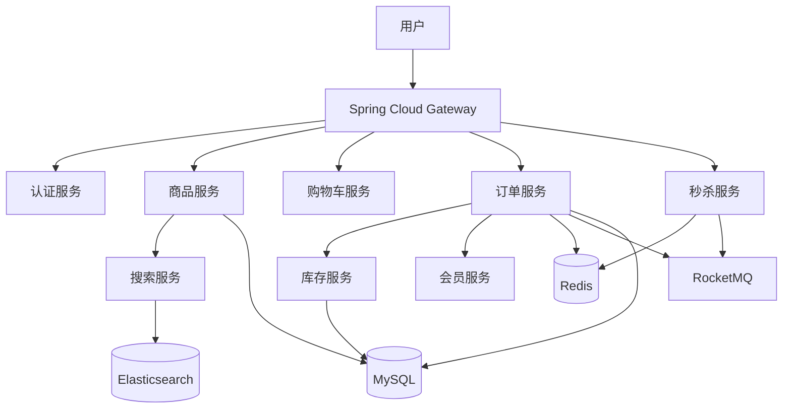
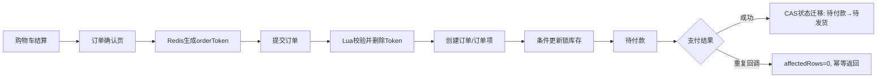

# 3C 数码商城交易系统

> 面向校招展示的 Java 后端作品。项目以公开课程商城代码为基础进行二次开发，重点整理并强化 **订单、库存、秒杀、支付幂等与商品检索** 等交易链路。原项目许可证与版权信息见 `LICENSE`。

## 1. 项目定位

本仓库不追求“把所有商城功能都堆进去”，而是重点展示后端开发中最常见的交易问题：重复提交、重复支付回调、并发库存、秒杀削峰以及 Elasticsearch 商品检索。

**技术栈：** Spring Boot、Spring Cloud、OpenFeign、MyBatis-Plus、MySQL、Redis、Redisson、RocketMQ、Elasticsearch、Nacos、Sentinel。

## 2. 系统结构



## 3. 核心交易链路



## 4. 当前已落地的核心技术点

### 4.1 Redis Token + Lua 防重复提交

订单确认页生成 `orderToken` 并写入 Redis，提交订单时使用 Lua 将“比较 token + 删除 token”合并为一个原子操作。本作品版同时给 token 增加 30 分钟 TTL，避免无效 token 长期残留。

核心代码：`mall-order/.../OrderServiceImpl.java`

### 4.2 支付重复回调幂等

支付平台可能多次通知同一订单。作品版使用条件更新实现 CAS 状态迁移：

```sql
UPDATE oms_order
SET status = 1
WHERE order_sn = ?
  AND status = 0;
```

只有第一次回调能将“待付款”更新为“待发货”；重复回调影响行数为 0，不再重复履约。

核心代码：
- `mall-order/.../OrderDao.xml`
- `mall-order/.../OrderPayListener.java`
- `mall-order/.../OrderServiceImpl.java`

> 说明：真实支付生产环境还必须先完成签名、金额、商户号等校验。本项目的支付回调重点展示幂等状态迁移。

### 4.3 库存条件更新 + 固定更新顺序

原实现存在“先读库存、再无条件增加锁定库存”的并发窗口。作品版把库存条件放入 SQL：

```sql
UPDATE wms_ware_sku
SET stock_locked = stock_locked + ?
WHERE sku_id = ?
  AND ware_id = ?
  AND stock - stock_locked >= ?;
```

同时多 SKU 下单按 `skuId` 固定顺序处理，减少不同事务锁顺序不一致导致的死锁概率。

核心代码：
- `mall-ware/.../WareSkuDao.xml`
- `mall-ware/.../WareSkuServiceImpl.java`

### 4.4 秒杀：一人一单 + Redis/Redisson 预扣 + MQ 异步下单

秒杀商品提前写入 Redis；用户抢购时使用 `SETNX` 类语义记录购买标识，通过 Redisson Semaphore 控制可售库存，成功后使用 RocketMQ 异步创建秒杀订单。作品版补充了库存抢占失败时的一人一单占位回滚，避免失败后无法再次尝试。

核心代码：`mall-seckill/.../SeckillServiceImpl.java`

### 4.5 Elasticsearch 商品检索

商品服务组装 SKU 搜索模型后批量写入 Elasticsearch，搜索服务使用 ES 完成品牌、价格、分类及规格属性等组合查询。

核心代码：
- `mall-product/.../SpuInfoServiceImpl.java`
- `mall-search/.../ElasticSearchSaveServiceImpl.java`
- `mall-search/.../MallSearchServiceImpl.java`

## 5. 模块说明

| 模块 | 作用 |
|---|---|
| `mall-gateway` | 网关、路由 |
| `mall-auth_server` | 登录认证 |
| `mall-member` | 会员与地址 |
| `mall-product` | SPU/SKU、商品管理 |
| `mall-cart` | 购物车 |
| `mall-order` | 订单确认、提交、支付状态 |
| `mall-ware` | 库存查询与锁定 |
| `mall-seckill` | 秒杀活动与异步预订单 |
| `mall-search` | Elasticsearch 商品搜索 |
| `mall-coupon` | 优惠/活动基础数据 |
| `mall-third-party` | OSS、短信等第三方能力 |

## 6. 面试快速导航

| 面试问题 | 对应实现 |
|---|---|
| 如何防止重复下单？ | `OrderServiceImpl#submitOrder` |
| Lua 为什么能保证原子性？ | `OrderServiceImpl#submitOrder` |
| 支付重复回调怎么处理？ | `OrderDao#updateStatusIfCurrent` |
| 如何避免库存超卖？ | `WareSkuDao.xml#lockSkuStock` |
| 多 SKU 为什么容易死锁？ | `WareSkuServiceImpl#orderLockStock` |
| 秒杀如何做一人一单？ | `SeckillServiceImpl#kill` |
| 秒杀为什么需要 MQ？ | `SeckillServiceImpl#kill` + `SeckillOrderConsumer` |
| 商品检索为什么用 ES？ | `MallSearchServiceImpl` |

## 7. 运行前准备

建议准备：JDK 8、Maven、MySQL、Redis、Nacos、RocketMQ、Elasticsearch。第三方云服务配置全部通过环境变量注入，不要把真实 AccessKey、密码或短信 AppCode 提交到 Git。

本仓库用于学习、二次开发和校招技术展示。若仅阅读核心实现，可直接按照上面的“面试快速导航”定位代码，无需启动全部微服务。

## 8. 二次开发说明

本项目基于课程商城工程进行二次开发和代码整理，保留原项目 `LICENSE`。本人的主要工作集中在交易链路梳理、安全配置清理、订单/支付幂等、库存并发控制、秒杀健壮性优化以及校招作品集文档整理。
