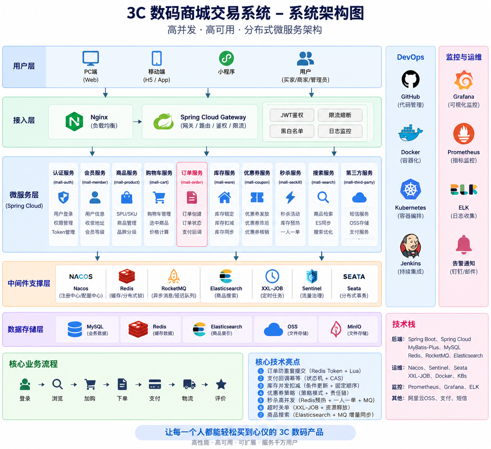
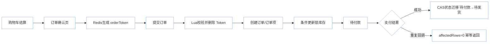

# 3C 数码商城交易系统

## 项目背景

随着智能手机、电脑、智能穿戴等 3C
数码产品线上消费规模不断扩大，电商平台需要支撑从商品展示、购物车、订单交易、支付结算到库存管理的完整业务链路。

相比普通商品交易，3C 数码产品具有商品规格复杂、SKU
数量多、库存价值高、促销活动频繁等特点。例如同一款手机可能包含不同内存、颜色、版本等多个
SKU，平台不仅需要保证商品信息准确，还需要保证库存实时可靠以及交易流程稳定。

在大型促销活动、新品发布等场景下，商城系统需要面对瞬时高并发访问、大量订单创建、库存竞争以及支付状态同步等问题。因此，一个稳定、高效、可扩展的商城交易系统，需要通过合理的服务拆分以及针对核心交易链路的优化，保证业务连续性和数据一致性。

## 项目介绍

本项目围绕 3C 数码电商交易场景，基于 Spring Cloud
微服务架构实现用户、商品、购物车、订单、库存、营销、秒杀以及搜索等核心业务模块。

项目在原商城工程基础上进行了业务梳理和工程优化，重点针对商城系统中的关键工程问题进行优化：

-   订单提交过程中的重复请求问题
-   支付回调过程中的状态一致性问题
-   高并发购买场景下库存超卖问题
-   秒杀活动中的瞬时流量冲击问题
-   海量商品查询场景下的搜索性能问题

通过 Redis、RocketMQ、Elasticsearch、MySQL
条件更新等技术，对核心交易链路进行优化。

# 项目亮点

## 1. 分布式交易链路优化

围绕商城核心交易流程，对订单、库存、支付等关键环节进行了优化：

-   Redis Token + Lua 实现订单防重复提交
-   CAS 条件更新保证支付回调幂等
-   MySQL 条件更新避免库存超卖
-   RocketMQ 异步削峰提升系统吞吐能力
-   Elasticsearch 提升商品搜索效率

## 2. 面向业务场景的工程优化

项目重点关注真实商城业务中的关键问题：

-   用户重复点击提交订单如何避免重复创建
-   支付平台重复回调如何保证数据一致
-   多用户同时购买如何保证库存正确
-   秒杀场景如何降低数据库压力

# 系统架构

项目采用 Spring Cloud 微服务架构，根据业务领域进行服务拆分：

-   Gateway 网关服务
-   认证服务
-   商品服务
-   购物车服务
-   订单服务
-   库存服务
-   会员服务
-   优惠券服务
-   秒杀服务
-   搜索服务
-   第三方服务

## 系统架构图



# 核心交易链路

## 下单与支付核心链路



# 核心技术优化

## Redis + Lua 实现订单防重复提交

业务问题：

用户在网络延迟或重复点击情况下，可能多次提交订单请求，造成重复创建订单。

解决方案：

订单确认页生成 orderToken，提交订单时使用 Lua 脚本完成：

1.  校验 Token
2.  删除 Token

保证校验和删除操作原子执行。

核心代码位置：

``` text
mall-order/.../OrderServiceImpl.java

submitOrder()
```

## 支付回调幂等设计

支付平台可能由于网络原因重复发送支付成功通知。

通过数据库 CAS 条件更新限制订单状态流转：

``` sql
update oms_order
set status = '待发货'
where order_sn = ?
and status = '待付款';
```

第一次回调：

``` text
affectedRows = 1
```

重复回调：

``` text
affectedRows = 0
无需处理
```

核心代码位置：

``` text
mall-order/.../OrderServiceImpl.java

handlePayResult()
```

## 库存条件更新防止超卖

多个用户同时购买同一个 SKU 时，直接扣减库存可能导致库存异常。

采用数据库条件更新：

``` sql
update wms_ware_sku
set stock_locked = stock_locked + #{num}
where sku_id = #{skuId}
and stock - stock_locked >= #{num};
```

核心代码位置：

``` text
mall-ware/.../WareSkuDao.xml

lockSkuStock()
```

# 商品搜索优化

商品数量增加后，复杂条件查询会影响数据库查询性能。

将商品数据同步至 Elasticsearch：

核心代码位置：

``` text
mall-product/.../SpuInfoServiceImpl.java

mall-search/.../ElasticSearchSaveServiceImpl.java

mall-search/.../MallSearchServiceImpl.java
```

# 技术栈

  技术            应用
  --------------- --------------------
  Spring Boot     服务开发
  Spring Cloud    微服务治理
  Gateway         网关路由
  Nacos           注册中心与配置中心
  OpenFeign       服务调用
  MyBatis-Plus    数据访问
  MySQL           业务数据存储
  Redis           缓存与分布式控制
  RocketMQ        异步消息
  Elasticsearch   商品搜索
  Seata           分布式事务
  Sentinel        服务保护

# 项目总结

本项目围绕 3C
数码电商交易场景，实践了微服务架构设计、高并发订单处理、Redis
原子操作、MQ 异步解耦、接口幂等设计、库存一致性控制以及搜索服务优化。

通过对核心业务链路的优化，使系统从完成基础业务功能进一步提升到解决真实工程问题。
